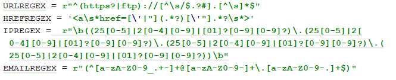
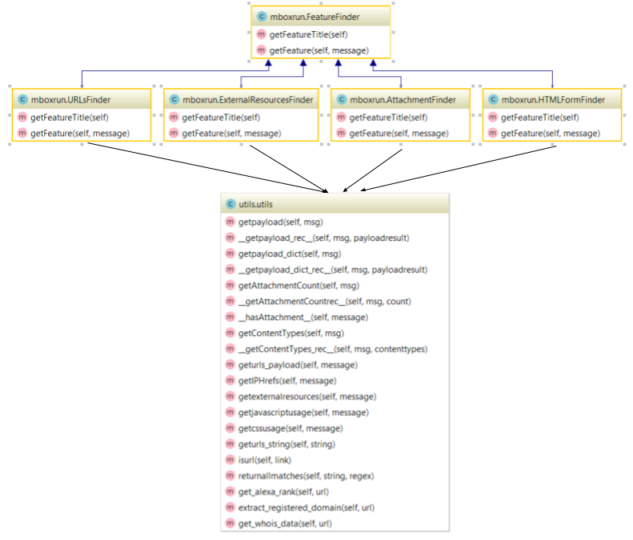
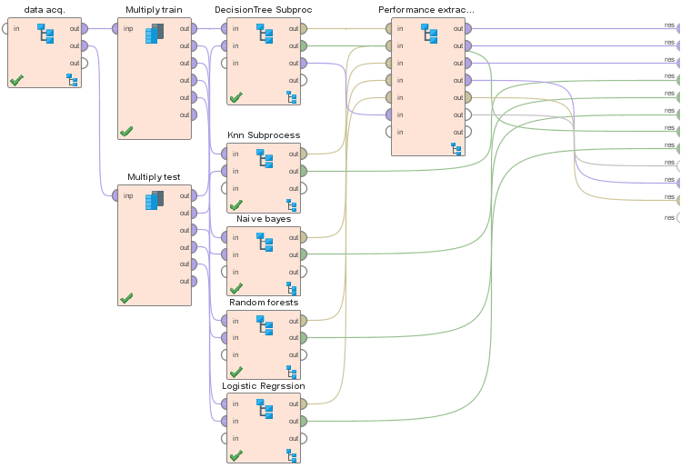
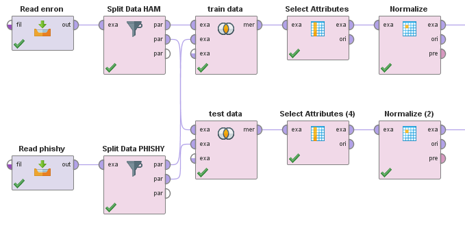
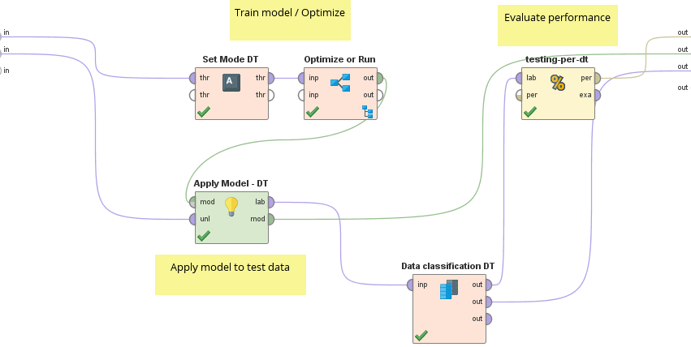

Introduction
============

Phishing is a type of cybercrime in which attackers try to steal
sensitive information, by using social engineering techniques,
masquerading trusted third parties. According to @Stavroulakis “Phishing
is the attempt to obtain sensitive information such as usernames,
passwords, and credit card details (and, indirectly, money), often for
malicious reasons, by disguising as a trustworthy entity in an
electronic communication”. This is a well-known attack since it affects
people worldwide, it is independent of the O.S, device, e-mail provider,
platform.

Typically, attackers are interested in information and credentials such
as: personal email, credit cards, social media, e-commerce and digital
wallets. There were 1.2 million phishing attacks only last year, costing
more than half a billion dollars to American business. There is a clear
growth tendency:

Project goal
============

Despite all the research and anti-phishing tools, this is a threat of
growing concern that needs to be addressed. The aim of this project is
to measure the efficiency of machine learning algorithms in detecting
phishing emails and it will determine which machine learning algorithm,
under supervised classification, suits best to resolve this problem.
Moreover, this project proposes a wide variety of features to be
analyzed in phishing emails, both internal and external aspects.

Approach
========

To accomplish this project, two raw datasets will be used. The first one
is a large phishing corpus that contains more than 2000 real phishing
emails in a single *mbox* file. The second is a large database of real
and non-phishy or spam emails obtained from the Enron Email
Database[^1]. Both datasets are in different formats and need to be
uniformalized.

Once the data is transformed into a single format (see Methods), they
will be used to create a new dataset, consisting of the features
detected (or absent) in the emails. The identified features are
categorized in internal and external. Internal features are those found
in the raw format of the email, e.g. the reply-to address, MIME TYPE,
HTML body, javascript usage, etc. External features are those that use
internal details to gather more information via APIs, e.g: using the
host of the sender’s address, perform WHOIS queries to gather
information regarding the registar.

After the features have been gathered from the emails, a dataset is
built with such the features and the label indicating if the values
correspond to a phishy or a normal and expectable email. With this
dataset, the different machine learning algorithms are trained and then
tested.

For the sake of reproducibility, all the code, data and RapidMiner
process definition will be available in a public GitHub respository
created for this project[^2].

Methods
=======

For this project, two datasets were used. The first one is a phishing
email corpus[^3] containing more than 2000 phishing emails in a single
text file of 400.000 lines in the *mbox* format. Every email in this
dataset is a reported and verified phishing attempt. The link to the
phishing corpus was retrieved from other papers that studied phishy
emails. By the moment the dataset was to be accessed, the file was no
longer available. In order to acquire the dataset, the Web Archive[^4]
was used to retrieve the lastest version available and the folling link
was found to download the dataset:
*http://monkey.org/ jose/phishing/phishing3.mbox*. The dataset will be
published in the same GitHub repository with the rest of the code, to
ensure reproducibility of this work.

The second dataset contains regular or non-phishing emails, from the
Enron email corpus. This is a 1.7GB emails dataset in a folder
structure, in which there is mailbox per employee, with several
subfolders per each one. This email corpus is in the *maildir* format.

The first step was transforming the datasets into a single format. This
first step is achieved using a Python script that transforms *maildir*
to *mbox* format. A script hosted on GitHub was used for this
purpose[^5]. This script presented some bugs that made the script
unsuitable for the current problem. The corrected version of the script
will be available on the public repository where this project is hosted
on GitHub.

The script transformed every email from the *maildir* format into an
email in the *mbox* format. Therefore, further concatenation was needed
to build a single *mbox* file with 2000 non-phishy emails. This is done
by an additional script developed for this project that takes 2000
random mbox files and concatenates them into a single mbox. By this
point we have 2 uniform *mbox* datasets, each with 2000 emails
approximately ready to be processed.

The next step consists on the feature gathering of the emails to create
the features dataset, which will be the input for machine learning
algorithms. The features that are currently implemented are:

-   @ in URLs. Detects the presence of the \`\`@" character in URLs. T/F
    value.

-   Number of Attachments. Detects the number of attachments present in
    the email. Numerical value

-   Css in header. Detects the number of Css links in the emails’ body,
    under the head tag in the html message. Numerical value

-   External Resources. Detects the number of external resources linked
    in the body of the email. Numerical value

-   Flash content. Detects the presence of flash content in the body of
    the email. T/F value.

-   HTML content. Detects the presence of HTML content. T/F value.

-   Html Form. Detects the presence of HTML Forms. T/F value.

-   Html iFrame. Detects the presence of HTML iFrames. T/F value.

-   IPs in URLs. Detects the presence of IPs in URLS, instead of human
    readable domain names. T/F value.

-   Javascript blocks. Detects the number of Javascript blocks inside
    the email’s body.

-   URLs. Detects the number of URLS in the email.

In order to retrieve this features, several Python libraries were
required, such as Pandas, BeautifulSoup, Alexa Rank and PythonWhois. To
extract specific values and tags, regular expressions were used:

The feature gathering code is organized as followed: An abstract class
*FeatureFinder* with two methods: *getFeatureTitle* and
*getFeature(message)*. The first returns the title of the current
feature being resolved, e.g. *HTML iFrames*. The second method receives
the email message as a parameter and returns the value for the
corresponding feature finder.

This abstract class has as many generalizations as the current present
features. The specific feature finders use functions from the *utils*
class, that provides common methods for accessing data and values inside
the email message, among other tasks.

This use of Polymorphism and OOP (Object Oriented Programming) makes the
code more organized, clear and easy to understand. Furthermore, adding a
new feature finder only implies implementing the new FeatureFinder
subclass, implement the abstract methods and add the new instance to the
finders lists. The values from this new finder will be included in the
final CSV file without further coding.

For the sake of clarity, in the following diagram only 4 generalizations
of feature finder were included:

This process produces 2 output CSV files. The first file with the
features of phishing emails and an extra column of “Phishy” with True as
a value for all. The other file with the features of ham (non-phishy)
emails and an extra column of “Phishy” with False as a value for all.
The division of 80%-20% for training and testing respectively is done by
the RapidMiner tool with its ETL capabilities.

This dataset features is used to train and test the algorithms. 80% of
emails will be used for training purposes and the rest 20% for testing
the algorithms and measure their efficiency. With the 20% of the emails,
the precision, recall and accuracy of each machine learning algorithm
will be tested. This will determine which algorithm performed best at
identifying phishing emails in the proposed data context and features
model. The algorithms analysed are:

1.  Decision trees

2.  KNN

3.  Random forests

4.  Naive Bayes

The algorithm that is not implemented yet is Logistic regression.\
To train and test the algorithms, view results, and perform some ETL
processes such as splitting the input dataset into training and testing,
RapidMiner was used. This tool allows the execution of several machine
learning algorithms via the design of a data flow. This is done using
provided building blocks and custom building blocks can be built to
enhance reusability. The diagram is explanatory of the process, the
steps involved and in which order they are executed. Any changes in the
flow does not mean changes in code, rather, by simply changing the
design or parameters, the entire solution can easily change.

For reproducibility purposes, RapidMiner is free to try in its community
edition, being the only constraint the number of processed rows.
RapidMiner offers free licences for students and researchers, so anyone
interested in reproducing the flow developed for this project could do
so without having to pay for any licence. In any case, RapidMiner allows
the export of the process as a PMML file. This kind of process
definition file can be executed from a python environment without
relying on rapidminer.

The following is an image of the current flow designed for this project:

 [fig:root]

The Root flow uses custom built building blocks, such as *data acq.*
(data acquisition) and each of the sub-processes on the right side of
the diagram. One sub-process per machine learning algorithm.

The following image shows the data acquisition building block. This
custom build step is in charge of the retrieval and splitting the data
into 80% training and 20% testing. The first two steps *Read enron* and
*Read phishy* are CSV file readers and are processing the CSV input
files. The next steps are the *Split Data HAM* and *Split Data PHISHY*.
These steps divide the input in the proportions described before.

The next two steps will merge the 80% of HAM email with 80% of Phishy
email, and as an output we have the training set. The other test does
the same for the testing set, with 20% of each. The data split is always
performed in the same sequential order and testing data will never fall
into the training flow.

Therefore, this building block has 2 outputs: 1) Training data and 2)
Testing data.

Once we have the separate datasets, we have to train the algorithms and
test their performance. That is the role of the custom built building
block for each machine learning algorithm depicted in the following
diagram:

The first input is the training dataset and the second the testing
dataset. The training dataset goes into a *Optimize parameters* step, in
which different parameters values are tested in the algorithm in order
to find the optimal configuration. In this optimization process, the
testing data is not used. Such process has the model as an output. Such
model is then applied to the testing data and then the performance is
evaluated.\
\
This process, once executed, will first create the models with the
training data, test the performance with testing data and show the
results

Current results
===============

The current developed workflow on RapidMiner trains and evaluates
Decision trees, KNN, Random forests and Naive Bayes. Logistic Regression
is still being developed due to other constraints that such algorithm
requires. The following table and bar chart show the accuracy, recall
and precision for each algorithm.

Currently the algorithm that performs bests in this scenario and with
this email corpus is Naive Bayes with an accuracy of 99,18% and a recall
of 98,46%. These results may vary when the project is done, as value
normalization and other optimizations are due.

Summary and conclusion
======================

From the preliminary results, it is clear that Naive Bayes is the best
algorithm in detecting this kind of problem given the current training
set. With a precision of 100% in al cases, this means that every
non-phishy email would be correctly identified and would not fall under
the spam folder if this were to be implemented in a real solution.

On the other hand, a small portion of the phishing attempts will fall
under the inbox undetected. In the case of Naive Bayes, 9 out of 456
phishing emails would pass undetected. That is approximately 2% of the
testing corpus. Values from the dataset have to be normalized and that
may affect the performance results. Additionally, the optimal parameters
for each algorithm is still pending.\
\
Further work is going to be done in order to analyse from the testing
data, what examples are causing the loss in recall. Once these cases
have been examined, the model could be tuned with the aim of improving
the overall results.

[^1]: https://www.cs.cmu.edu/ ./enron/

[^2]: https://github.com/diegoocampoh/MachineLearningPhishing

[^3]: Phishing corpus - Nazario. phishingcorpus homepage, Apr. 2006.
    http://monkey.org/%7Ejose/wiki/doku.php?id=PhishingCorpus

[^4]: Web Archive - https://archive.org/web/

[^5]: https://github.com/bluebird75/maildir2mbox/blob/master/maildir2mbox.py
